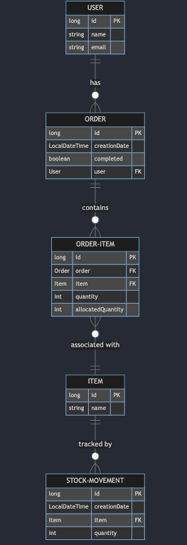

# STOCK ORDER API

## Description

This REST API is designed for stock order management. Developed in Java 8 and Spring Boot, it leverages PostgreSQL for database management and Maven for project build and dependencies management. It's equipped with a comprehensive set of functionalities for managing items, orders, stock movements, and users.

## Technical Stack

* **Java:** Version 8
* **PostgreSQL:** For database management
* **Spring Boot:** Version 2.5.4 for REST API framework
* **Maven:** Dependency management and project build
* **Lombok:** For reducing boilerplate code
* **Swagger:** API documentation

# About the Project

This project serves as a REST API for managing stock orders. It encompasses various controllers and services to handle different aspects of stock order management.

## Item Controller

The Item Controller is responsible for managing operations related to items within the system. It provides the following functionalities:

- **Listing Items:** Offers endpoints to list all available items in the system.
- **Creating Items:** Allows the creation of new items with specified details.
- **Updating Items:** Provides the ability to update existing item information.
- **Deleting Items:** Enables the removal of items from the system.
- **Retrieving Item Details:** Includes an endpoint to retrieve detailed information about a specific item.

## Order Controller

The Order Controller focuses on handling order management operations. It offers the following features:

- **Creating Orders:** Allows the creation of new orders, specifying order details and items.
- **Listing Orders:** Provides endpoints to list all existing orders in the system.
- **Updating Orders:** Enables the modification of order information.
- **Deleting Orders:** Allows the removal of orders from the system.
- **Retrieving Order Details:** Includes an endpoint to retrieve detailed information about a specific order.

## Stock Movement Controller

The Stock Movement Controller is responsible for managing stock movement operations within the system. It offers the following functionalities:

- **Listing Stock Movements:** Provides endpoints to list all stock movements.
- **Creating Stock Movements:** Allows the creation of stock movements, specifying the item and quantity.
- **Updating Stock Movements:** Enables the modification of stock movement records.
- **Deleting Stock Movements:** Allows the removal of stock movement records.
- **Retrieving Stock Movement Details:** Includes an endpoint to retrieve stock movement information for a specific product.

## User Controller

The User Controller handles user management operations. It offers the following features:

- **Creating Users:** Allows the creation of new user accounts with relevant information.
- **Listing Users:** Provides endpoints to list all users in the system.
- **Updating Users:** Enables the modification of user account details.
- **Deleting Users:** Allows the removal of user accounts from the system.
- **Retrieving User Details:** Includes an endpoint to retrieve detailed information about a specific user.

## Stock Movement Service

The Stock Movement Service manages all operations related to stock movements. It includes the following functionalities:

- **Creating Stock Movements:** Handles the creation of new stock movements, updating stock quantities.
- **Updating Stock Movements:** Allows the modification of existing stock movement records.
- **Deleting Stock Movements:** Enables the removal of stock movement records.
- **Stock Allocation:** Coordinates the allocation of stock to pending orders.
- **Logging:** Responsible for logging stock-related activities within the system.

## Order Service

The Order Service is in charge of all order-related operations within the system. It provides the following functionalities:

- **Creating Orders:** Manages the creation of new orders, including stock allocation and completion checks.
- **Updating Orders:** Allows the modification of existing order details and allocated quantities.
- **Deleting Orders:** Enables the removal of orders from the system.
- **Email Notifications:** Sends email notifications to users when orders are successfully completed.
- **Stock Allocation:** Coordinates the allocation of stock to pending orders.
- **Logging:** Logs order-related activities and stock allocations within the system.

## Accessing API Documentation with Swagger

For detailed information about the API endpoints and for testing purposes, you can access the Swagger UI documentation. Please note that the Swagger UI is hosted locally and requires the API to be running on your local environment.

To view the documentation, navigate to the following address in your web browser while the API is running:

[Swagger UI Documentation](http://localhost:8080/swagger-ui/)

Ensure that your local server is active and accessible on port 8080. This link will


## API Testing with Postman

You can test the API using Postman. The Postman collection for the API is available for download:

[Download Postman Collection](SIBS.postman_collection.json)


# Model Layer Entities

The model layer in this project, built using Maven and managed with PostgreSQL, consists of several entities. Each entity represents a specific aspect of the system's domain.

### Item

- **Description:** Represents a product in the system.
- **Attributes:**
  - `id`: A unique identifier for each item.
  - `name`: The name of the product.
- **Relationships:**
  - `OrderItem`: An item can be associated with multiple order items.
  - `StockMovement`: An item can have multiple stock movement records.

### Order

- **Description:** Represents an order placed by a user.
- **Attributes:**
  - `id`: A unique identifier for each order.
  - `creationDate`: The date and time when the order was created.
  - `completed`: A boolean indicating whether the order is completed.
- **Relationships:**
  - `User`: An order is associated with a user.
  - `OrderItem`: An order contains multiple order items.

### StockMovement

- **Description:** Represents a stock movement record.
- **Attributes:**
  - `id`: A unique identifier for each stock movement.
  - `creationDate`: The date and time when the stock movement was recorded.
  - `quantity`: The quantity of stock moved.
- **Relationships:**
  - `Item`: A stock movement is associated with an item.

### User

- **Description:** Represents a user account in the system.
- **Attributes:**
  - `id`: A unique identifier for each user.
  - `name`: The name of the user.
  - `email`: The email address of the user.
- **Relationships:**
  - `Order`: A user can place multiple orders.

### Diagram:



## Installation and Configuration

### Installing PostgreSQL

1. **Download PostgreSQL**: Download the PostgreSQL installer for Windows from
   the [official PostgreSQL website - 15.4-1-windows-x64.exe](https://get.enterprisedb.com/postgresql/postgresql-15.4-1-windows-x64.exe).
2. **Installation Process**: Run the downloaded installer and follow the on-screen instructions to complete the
   installation. Note down the superuser (postgres) password during installation.

### Starting PostgreSQL

1. **Open Command Prompt as Administrator**: Open the Command Prompt as an administrator.
2. **Navigate to PostgreSQL Directory**: Navigate to the PostgreSQL installation directory (usually located
   at `C:\Program Files\PostgreSQL\<version>`).
3. **Add bin Directory to PATH**: Inside the directory, locate the `bin` folder and add its full path to your PATH
   environment variable. Replace `<version>` with your actual PostgreSQL version.

   ```shell
   setx PATH "%PATH%;C:\Program Files\PostgreSQL\<version>\bin"

   ```

### Creating the Database

1. **Open Command Prompt as Administrator**: Open the Command Prompt as an administrator.
2. **Connect as Superuser**: Use the `psql` utility to connect to PostgreSQL as the superuser. Enter the password set
   during installation when prompted.

   ```shell
   psql -U postgres

   CREATE DATABASE stock-api;

   ```

### Configuring Database Connection in application.properties

1. **Open `application.properties`**: Open the `application.properties` file in your Spring Boot project.
2. **Database Connection Properties**: Configure the database connection properties in the `application.properties`
   file:

   ```yaml
   spring.datasource.url=jdbc:postgresql://localhost:5432/stock-api
    spring.datasource.username=postgres
    spring.datasource.password=postgresql
    spring.datasource.driver-class-name=org.postgresql.Driver
    spring.jpa.properties.hibernate.dialect=org.hibernate.dialect.PostgreSQLDialect

   ```

## Starting the Application

To start the Spring Boot application in IntelliJ IDEA or Eclipse, follow these steps:

**IntelliJ IDEA:**

1. Open IntelliJ IDEA and load your project.
2. Navigate to the project's root directory where the `pom.xml` file is located.
3. Open a terminal within IntelliJ IDEA by clicking on "View" -> "Tool Windows" -> "Terminal."
4. In the terminal, run the following command to build the project:

   ```shell
   mvn clean install

   java -jar target/pt-0.0.1-SNAPSHOT.jar

   (CONTROL+C) to shutdown app

   ```
5. **OR Execute on file explorer target/pt-0.0.1-SNAPSHOT.jar**

## Clone Repository GIT

To obtain the source code of the application, follow these steps:

1. Open the terminal or command prompt.
2. Execute the following command to clone the GIT repository:

   ```bash
   git clone URL-DO-REPOSITÓRIO

   ```

# Project Configuration

### Configuring SMTP Email for Gmail

To enable email notifications and sending emails through Gmail, follow these steps:

1. Open the project's configuration file (e.g., `application.properties` ).
2. Find the email configuration section in the file.
3. Update the following properties with your Gmail email address and password:

   ```yaml
   spring.mail.host=smtp.gmail.com
   spring.mail.port=587
   spring.mail.username=your.email@gmail.com
   spring.mail.password=your-email-password
   spring.mail.properties.mail.smtp.auth=true
   spring.mail.properties.mail.smtp.starttls.enable=true


   ```

If you want to contribute to the project, please follow the steps below:

1. Fork this repository
2. Create a branch: `git checkout -b <branch_name>`
3. Make your changes and confirm them: `git commit -m '<commit_message>'`
4. Send to the original branch: `git push origin <project_name>/<location>`
5. Create the pull request
6. Done!

## License
This project is licensed under the MIT License 
see the [LICENSE](LICENSE) file for details.

## Author

Made with ❤️ by [Matheus](https://github.com/MathSena) 👋🏽 Get in touch!

[](https://www.linkedin.com/in/mathsena/)
